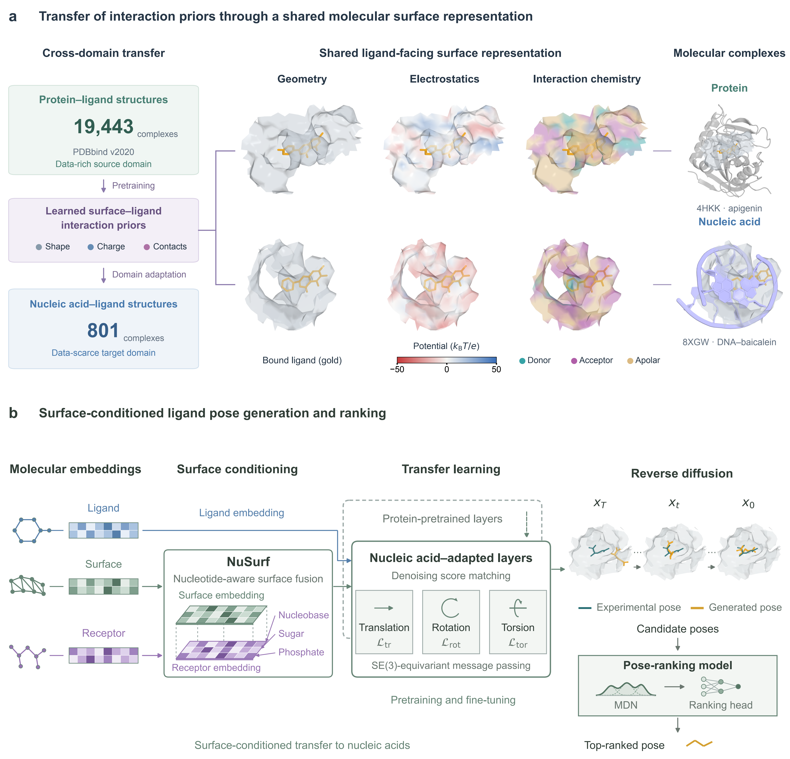

# SurfNA v2

SurfNA predicts nucleic-acid–ligand binding poses by transferring molecular-surface interaction features learned from protein–ligand docking. The V2 pipeline combines a diffusion **Generator**, frozen **MDN interaction features**, and a **Scorer** that ranks the generated poses.



This repository contains code, configurations, PDB identifiers and sample selections. **Download structures from the PDB and model weights from [Releases](https://github.com/Llewyn001/SurfNA/releases/tag/v2.0.0-rc1).** Prepared datasets, training feature arrays, generated pose banks and intermediate training checkpoints are not included in the lightweight release.

## Installation

```bash
git clone --depth 1 https://github.com/Llewyn001/SurfNA.git
cd SurfNA
```

Follow [the Linux/CUDA installation instructions](docs/INSTALL.md). The molecular graph models require CUDA. Run commands below from the repository root.

## Model weights

```bash
python scripts/download_checkpoints.py --set default
python scripts/precompute_diffusion_tables.py
```

The default checkpoint set contains the seed-0 EMA350 Generator, frozen native MDN and final Scorer (W0), including the required reference and normalization files. Diffusion lookup tables are generated locally once; they are deterministic numerical grids rather than training data and are not bundled with the weights. Their first computation can take time and requires several GB of free RAM.

For the two additional Generator repetitions in the main benchmark:

```bash
python scripts/download_checkpoints.py --set benchmark-repeats
```

See [the checkpoint guide](docs/CHECKPOINTS.md) for file sizes, hashes and experiment mapping. Intermediate epoch checkpoints remain outside this lightweight release.

## Obtain the structures

The dataset comprises **801 training, 89 validation and 128 test ligand instances from 699 PDB entries**. An entry may contribute more than one ligand instance. The public lists preserve the original split and identify the target ligand and receptor context.

```bash
python scripts/download_pdb.py --split test --ccd --output data/raw
# Use --split all to retrieve the training, validation and test entries.
```

[Data preparation](docs/DATA.md) describes chain/residue selection, CCD chemistry, surface features and duplicate control. PDB coordinates are downloaded directly from the original provider; this repository does not redistribute a prepared dataset.

## Generate and rank poses

Prepare each receptor, ligand and surface following the data guide. The named input convention is:

```text
data/prepared/<name>/<name>_protein_processed.pdb
data/prepared/<name>/<name>_ligand.sdf
data/surfaces/<name>/<name>_protein_8A.ply
```

Build the graph cache:

```bash
python scripts/prepare_graphs.py \
  --data data/prepared --surfaces data/surfaces \
  --names datasets/test_complexes.txt --output data/graphs
```

The command writes the generated cache location to `data/graphs/preparation.json`. Pass that directory, which contains `heterographs.pkl` and `rdkit_ligands.pkl`, to generation:

```bash
python scripts/generate.py \
  --cache /path/reported/in/preparation.json \
  --receptor-root data/prepared --names examples/one_complex.txt \
  --output runs/generated --samples 40 --batch-size 10 --device cuda
python scripts/rank_poses.py \
  --manifest runs/generated/1am0/manifest.json \
  --output runs/ranked --device cuda
```

The Generator performs 20 reverse-diffusion iterations. The Scorer ranks the **complete ensemble of 40 poses**; the frozen MDN is one feature source, rather than the final ranking function. Generated SDFs retain the receptor coordinate frame.

The reported benchmark is known-site holo redocking: native ligand coordinates define receptor context and surface cropping. It does not evaluate binding-site discovery.

## Methods and paper results

- [Model description](docs/MODEL_CARD.md): Generator, native MDN and Scorer.
- [Data and preprocessing](docs/DATA.md): PDB selections, chemistry, surface construction and splits.
- [Reproduction map](docs/REPRODUCIBILITY.md): Figures 2–4 protocols and numeric source tables.
- [Training material](docs/TRAINING.md): transfer initialization, native MDN adaptation and Scorer objective.

The released inference weights are the recorded paper models. The new download scripts and the full PDB-to-prediction workflow were not executed during this publication pass. Historical training/analysis implementations retain some original path assumptions; this release does not claim fully automated retraining of every experiment.

The earlier MDN-ranking implementation remains in [the V1 commit](https://github.com/Llewyn001/SurfNA/tree/5c2def14440253b1282f94ede3667455e4c81943).

## License and attribution

The project-specific code and checkpoint license has not yet been specified; see [LICENSE_PENDING.md](LICENSE_PENDING.md). Existing third-party notices remain applicable.

See [CITATION.md](CITATION.md) for the manuscript and [THIRD_PARTY_NOTICES.md](THIRD_PARTY_NOTICES.md) for inherited SurfDock/DiffDock code and separately installed software. PDB and PDBbind resources remain subject to their providers' terms.
